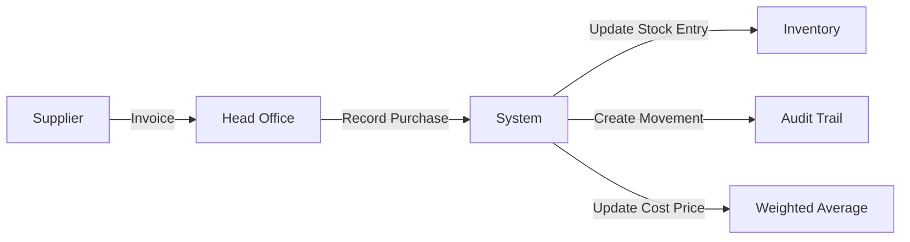
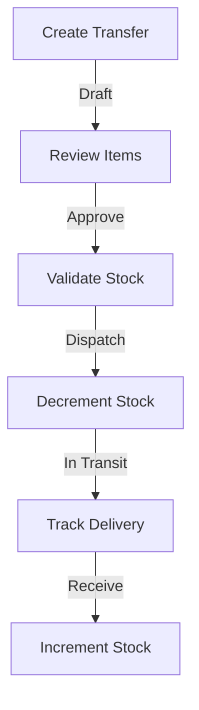
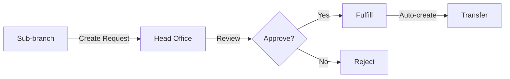
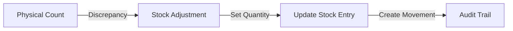

# Inventory Management System - Features Overview

Complete implementation of the Bangladesh retail inventory system with Head Office → Sub-branch flow.

## 📋 Table of Contents

1. [Architecture](#architecture)
2. [Pages & Navigation](#pages--navigation)
3. [API Structure](#api-structure)
4. [Features by Page](#features-by-page)
5. [Workflows](#workflows)
6. [Access Control](#access-control)

---

## Architecture

### Supply Chain Flow

```
┌─────────────────┐
│   Head Office   │ ← Purchases from Suppliers
│  (Warehouse)    │
└────────┬────────┘
         │
         │ Transfers (Challan)
         ├──────────────┬──────────────┐
         ▼              ▼              ▼
    ┌─────────┐   ┌─────────┐   ┌─────────┐
    │ Store 1 │   │ Store 2 │   │ Store 3 │
    └─────────┘   └─────────┘   └─────────┘
         │              │              │
         └──────────────┴──────────────┘
                        │
                        ▼ Stock Requests
                 ┌─────────────┐
                 │ Head Office │
                 └─────────────┘
```

### Key Principles

- **Single Source of Entry**: Only head office records purchases
- **Cost Tracking**: Weighted average cost propagated through transfers
- **Audit Trail**: Every stock movement is tracked
- **Branch Isolation**: Each branch has separate stock levels

---

## Pages & Navigation

### Dashboard Navigation

All inventory pages are accessible from `/dashboard/inventory`:

| Page | Route | Description | Role Access |
|------|-------|-------------|-------------|
| **Stock Levels** | `/dashboard/inventory` | View current stock at selected branch | All |
| **Low Stock Alerts** | `/dashboard/inventory/low-stock` | Items below reorder point | All |
| **Transfers (Challan)** | `/dashboard/inventory/transfers` | Inter-branch stock movement | All |
| **Stock Requests** | `/dashboard/inventory/requests` | Sub-branches request stock | All |
| **Purchases** | `/dashboard/inventory/purchases` | Supplier purchases (Head Office only) | Head Office |
| **Stock Movements** | `/dashboard/inventory/movements` | Audit trail of all changes | All |

### Sidebar Structure

```
📦 Inventory
  ├── 📊 Stock Levels
  ├── ⚠️  Low Stock Alerts
  ├── 🚚 Transfers (Challan)
  ├── 📥 Stock Requests
  ├── 🛒 Purchases (Head Office)
  └── 📋 Stock Movements
```

---

## API Structure

### Main API File
**Location**: `api/platform/inventory-api.ts`

Built using `BaseApi` pattern from `api-factory.ts`, providing:
- Consistent error handling
- Pagination support (offset/keyset)
- Query parameter processing
- Type safety

### API Modules

#### 1. Purchases
```typescript
// Record purchase at head office
inventoryApi.recordPurchase({ token, data })

// View purchase history
inventoryApi.purchaseHistory({ token, params })
```

#### 2. Transfers
```typescript
// CRUD operations
inventoryApi.listTransfers({ token, params })
inventoryApi.getTransfer({ token, id })
inventoryApi.createTransfer({ token, data })
inventoryApi.updateTransfer({ token, id, data })
inventoryApi.transferStats({ token, params })

// State transitions (Stripe pattern)
inventoryApi.approveTransfer({ token, id })
inventoryApi.dispatchTransfer({ token, id, data })
inventoryApi.markInTransit({ token, id })
inventoryApi.receiveTransfer({ token, id, data })
inventoryApi.cancelTransfer({ token, id, data })
```

#### 3. Stock Requests
```typescript
// CRUD operations
inventoryApi.listRequests({ token, params })
inventoryApi.getRequest({ token, id })
inventoryApi.createRequest({ token, data })

// State transitions
inventoryApi.approveRequest({ token, id, data })
inventoryApi.rejectRequest({ token, id, data })
inventoryApi.fulfillRequest({ token, id, data })
inventoryApi.cancelRequest({ token, id, data })
```

#### 4. Stock Viewing & Audit
```typescript
// Low stock alerts
inventoryApi.lowStock({ token, params })

// Movement audit trail
inventoryApi.movements({ token, params })

// Manual adjustments
inventoryApi.createAdjustment({ token, data })
inventoryApi.adjustStock({ token, data })
```

---

## Features by Page

### 1. Stock Levels (`/dashboard/inventory`)

**Components**:
- `InventoryClient.tsx` - Main client component
- `InventorySearch.tsx` - Search and filters
- `StockAdjustmentDialog.tsx` - Set stock levels
- `inventory-columns.tsx` - Table columns

**Features**:
- ✅ Real-time stock levels per branch
- ✅ Product search (name/SKU/barcode)
- ✅ Category filtering
- ✅ Stock status filtering (all/in-stock/low/out)
- ✅ Variant stock display
- ✅ Stock adjustment (set mode)
- ✅ Access control (sub-branches can only decrease)
- ✅ Summary stats cards

**Stats Cards**:
- Total Items
- Total Quantity
- Low Stock Count
- Out of Stock Count

---

### 2. Low Stock Alerts (`/dashboard/inventory/low-stock`)

**Components**:
- `LowStockClient.tsx` - Main client component
- `low-stock-columns.tsx` - Table columns

**Features**:
- ✅ Items below reorder point
- ✅ Stock level percentage indicators
- ✅ Critical/Low/Out badges
- ✅ Stock needed calculation
- ✅ Branch-specific alerts
- ✅ Summary stats

**Stats Cards**:
- Total Alerts
- Out of Stock (0 quantity)
- Critical (<25% of reorder point)
- Low (25-50% of reorder point)

**Alert Levels**:
- 🔴 **Out of Stock**: quantity = 0
- 🟠 **Critical**: quantity < 25% of reorder point
- 🟡 **Low**: 25% ≤ quantity < 50% of reorder point

---

### 3. Transfers (Challan) (`/dashboard/inventory/transfers`)

**Components**:
- `TransfersClient.tsx` - Main client component
- `TransferCreateDialog.tsx` - Create new transfer
- `TransferStatsCards.tsx` - Statistics display
- `transfer-columns.tsx` - Table columns

**Features**:
- ✅ Transfer workflow (draft → approved → dispatched → in-transit → received)
- ✅ Challan number auto-generation (CHN-YYYYMM-NNNN)
- ✅ Transport details (vehicle, driver, ETA)
- ✅ Partial receipt support
- ✅ Transfer cancellation
- ✅ Status badges and filters
- ✅ Transfer statistics
- ✅ Role-based actions

**Stats Cards**:
- Total Transfers
- Pending (draft + approved)
- In Transit
- Received

**Transfer Flow** (Head Office):
1. Create transfer (draft)
2. Approve (validates stock availability)
3. Dispatch (decrements sender stock, adds transport)
4. Mark in-transit (optional tracking step)
5. Receive (increments receiver stock)

**Sub-branch Actions**:
- Receive transfers
- View transfer history
- Track in-transit packages

---

### 4. Stock Requests (`/dashboard/inventory/requests`)

**Components**:
- `RequestsClient.tsx` - Main client component
- `RequestCreateDialog.tsx` - Create new request
- `request-columns.tsx` - Table columns

**Features**:
- ✅ Sub-branches request stock from head office
- ✅ Request approval workflow
- ✅ Quantity modification on approval
- ✅ Auto-fulfill creates transfer
- ✅ Rejection with reason
- ✅ Priority levels
- ✅ Notes and review notes

**Request Flow** (Sub-branch):
1. Create request (pending)
2. Head office reviews
3. Approve (with optional quantity changes)
4. Fulfill (auto-creates transfer)

**Head Office Actions**:
- Approve/Reject requests
- Modify approved quantities
- Fulfill (creates transfer document)

---

### 5. Purchases (`/dashboard/inventory/purchases`)

**Components**:
- `PurchasesClient.tsx` - Main client component
- `PurchaseCreateDialog.tsx` - Record new purchase
- Uses `movement-columns.tsx` for history

**Features**:
- ✅ Record supplier purchases (Head Office only)
- ✅ Batch item entry with barcode scanning
- ✅ Cost price tracking (weighted average)
- ✅ Optional transaction creation
- ✅ Purchase history (stock movements)
- ✅ Supplier reference tracking

**Purchase Options**:
- **Single item**: Record one product at a time
- **Batch entry**: Scan multiple items
- **Cost correction**: Update cost without changing quantity

**Transaction Control**:
- `createTransaction: false` - Stock entry only (manufacturing)
- `createTransaction: true` - Creates expense transaction (actual purchases)

---

### 6. Stock Movements (`/dashboard/inventory/movements`)

**Components**:
- `MovementsClient.tsx` - Main client component
- `movement-columns.tsx` - Table columns

**Features**:
- ✅ Complete audit trail
- ✅ Filter by product/branch/type/date
- ✅ Movement types: purchase, sale, transfer_in, transfer_out, adjustment, initial, return
- ✅ Reference linking (to orders, transfers, etc.)
- ✅ Cost tracking per movement
- ✅ Quantity change history

**Movement Types**:
| Type | Description | Triggered By |
|------|-------------|--------------|
| `purchase` | Stock received from supplier | Purchase recording |
| `sale` | Stock sold to customer | POS/Web order |
| `transfer_in` | Received from another branch | Transfer receive |
| `transfer_out` | Sent to another branch | Transfer dispatch |
| `adjustment` | Manual correction | Stock adjustment |
| `return` | Stock restored | Order cancellation |
| `initial` | Initial stock setup | Bulk import |

**Data Retention**: Movements are auto-deleted after 2 years (MongoDB TTL)

---

## Workflows

### Workflow 1: Head Office Purchases Stock



**Steps**:
1. Navigate to `/dashboard/inventory/purchases`
2. Click "Record Purchase"
3. Scan/enter product barcodes
4. Enter quantities and cost prices
5. Submit
6. Stock is added to head office
7. Cost price is updated (weighted average)

### Workflow 2: Distribute to Sub-branches



**Steps**:
1. Navigate to `/dashboard/inventory/transfers`
2. Click "Create Transfer"
3. Select receiver branch
4. Scan/enter items and quantities
5. Submit (creates draft)
6. Approve (validates availability)
7. Dispatch (add transport details, stock moves out)
8. Mark in-transit (optional tracking)
9. Receive at sub-branch (stock moves in)

### Workflow 3: Sub-branch Requests Stock



**Steps**:
1. Sub-branch navigates to `/dashboard/inventory/requests`
2. Click "Create Request"
3. Add items with requested quantities
4. Submit
5. Head office reviews and approves/rejects
6. If approved, click "Fulfill"
7. System auto-creates transfer
8. Follow transfer workflow

### Workflow 4: Stock Adjustment (Corrections)



**Steps**:
1. Navigate to `/dashboard/inventory`
2. Find product
3. Click "Set Stock"
4. Enter new quantity
5. Add notes (reason for adjustment)
6. Submit

**Access Rules**:
- Head Office: Can increase/decrease
- Sub-branches: Can only decrease (use transfers to increase)

---

## Access Control

### Role-Based Features

| Feature | Head Office | Sub-branch | Notes |
|---------|-------------|------------|-------|
| View Stock | ✅ | ✅ | Branch-specific |
| Stock Adjustment | ✅ Full | ⚠️ Decrease only | Transfers required for increases |
| Create Transfer | ✅ | ❌ | Head office distributes |
| Receive Transfer | ✅ | ✅ | Both can receive |
| Create Request | ❌ | ✅ | Sub-branches request |
| Approve/Fulfill Request | ✅ | ❌ | Head office manages |
| Record Purchase | ✅ | ❌ | Head office only |
| View Movements | ✅ | ✅ | Branch-specific |
| View Low Stock | ✅ | ✅ | Branch-specific |

### Branch Roles

**Head Office** (`role: "head_office"`):
- Single branch with this role (enforced)
- Receives all purchases
- Creates and sends transfers
- Approves stock requests
- Full stock adjustment rights

**Sub-branch** (`role: "sub_branch"`):
- Multiple branches allowed
- Receives transfers
- Creates stock requests
- Limited adjustment rights (decrease only)
- Sells via POS

---

## Stock Movement Examples

### Example 1: Purchase at Head Office

```json
POST /api/v1/inventory/purchases
{
  "items": [
    {
      "productId": "prod_123",
      "variantSku": "SHIRT-M-BLUE",
      "quantity": 100,
      "costPrice": 500
    }
  ],
  "createTransaction": false
}
```

**Result**:
- Head office stock: +100 units
- Cost price: Updated (weighted average)
- Movement: `type: purchase`, `quantity: +100`

### Example 2: Transfer to Sub-branch

```json
POST /api/v1/inventory/transfers
{
  "receiverBranchId": "branch_sub1",
  "items": [
    {
      "productId": "prod_123",
      "variantSku": "SHIRT-M-BLUE",
      "quantity": 30
    }
  ]
}
```

**Dispatch**:
- Head office stock: -30 units
- Movement: `type: sale`, `quantity: -30` (dispatch side)

**Receive**:
- Sub-branch stock: +30 units
- Movement: `type: return`, `quantity: +30` (receive side)
- Cost price: Inherited from head office (weighted average)

### Example 3: Stock Request

```json
POST /api/v1/inventory/requests
{
  "items": [
    {
      "productId": "prod_123",
      "quantity": 20
    }
  ],
  "notes": "Low stock - running out"
}
```

**After Approval & Fulfillment**:
- Creates a transfer automatically
- Follow transfer workflow

---

## Integration Points

### POS System
- Stock decrements on sale
- Branch-specific inventory
- Real-time availability check

### Order Management
- Stock reservation on checkout
- Auto-decrement on fulfillment
- Return processing (stock increase)

### Financial System
- Optional transaction creation on purchases
- Expense tracking for lost/damaged stock
- COGS calculation (weighted average)

---

## Data Retention & Performance

### Retention Policies
- **Stock Entries**: Permanent
- **Transfers**: 2 years (TTL index)
- **Stock Movements**: 2 years (TTL index)
- **Requests**: 2 years (TTL index)

### Performance Optimizations
- Keyset pagination for large datasets
- Branch-specific queries
- Indexed fields: branchId, productId, status, createdAt
- Summary calculations cached

---

## Future Enhancements

### Planned Features
- [ ] Transfer detail view with status history timeline
- [ ] Partial receipt UI with item-by-item quantities
- [ ] Barcode printing for transfers (challan labels)
- [ ] Email notifications for stock requests
- [ ] Batch approval for multiple requests
- [ ] Transfer template system (recurring distributions)
- [ ] Stock forecasting based on sales velocity
- [ ] Multi-warehouse support (multiple head offices)

### API Enhancements Available (Not Yet in UI)
- Partial receipt support (backend ready)
- Status history tracking (backend ready)
- Transport tracking fields (backend ready)
- Document type variations (backend ready)

---

## Troubleshooting

### Common Issues

**Issue**: Sub-branch cannot increase stock via adjustment
**Solution**: This is by design. Use transfers to increase sub-branch stock.

**Issue**: Purchase button not showing
**Solution**: Purchases are only available at head office (`role: "head_office"`).

**Issue**: Transfer not showing in list
**Solution**: Check branch filter - transfers are filtered by sender/receiver branch.

**Issue**: Stock movement not appearing
**Solution**: Check date range and branch filters. Movements have 2-year retention.

---

## Support & Documentation

- **API Docs**: `/docs/api/commerce/inventory.md`
- **Challan Reference**: `/docs/api/commerce/inventory/challan.md`
- **Movement Types**: `/docs/api/commerce/inventory/stock-movements.md`
- **Branch Setup**: `/docs/api/commerce/branch.md`
